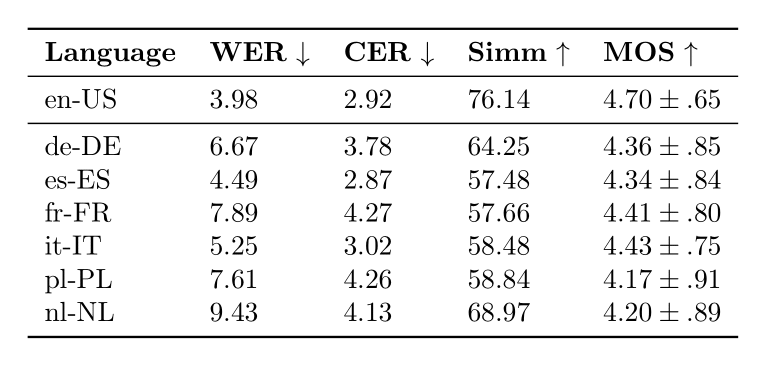

# Building a Multilingual Single-Speaker Dataset via Cross-Lingual Voice Cloning from LJSpeech

## Abstract
Speech synthesis models transform written text into lifelike, natural-sounding speech. However, even in multilingual systems, they often produce different voices for each language due to the lack of robust cross-lingual datasets and benchmarks.

In this work, we introduce the **MLJSpeech** corpus, a multilingual dataset created by machine translation and voice cloning the widely used LJSpeech dataset into multiple languages. To evaluate the quality of MLJSpeech, we conducted a Mean Opinion Score (MOS) assessment, achieving high perceptual quality across all target languages.

- The original LJSpeech received a MOS of **4.7 ± .65**.
- Our synthesized dataset maintained comparable performance across languages, like French **4.41 ± .80** or Italian **4.43 ± .75**.

MLJSpeech represents a significant step toward advancing cross-lingual TTS systems and fostering inclusivity in multilingual speech synthesis research.

## Audio Samples 🔊

To listen samples of MLJSpeech corpus visit the [demo webpage](https://samsung.github.io/MLJSpeech/).

## Results

### Evaluation of Correctness, Coherence and Quality

### Evaluation of Translation.

## About LJSpeech
[LJSpeech](https://keithito.com/LJ-Speech-Dataset/) is a widely used dataset in the Text-to-Speech (TTS) domain. It comprises approximately **24** hours of recordings from a single speaker reading passages from English nonfiction books. The audio was originally recorded by Linda Johnson as part of the LibriVox project. Corresponding texts were published between **1884** and **1964** and aligned by Keith Ito. Both have been released into the public domain. Since its release, LJSpeech has been extensively utilized to demonstrate various advancements in TTS systems. Its high recording quality and clean alignment make it a benchmark dataset for training and evaluating neural TTS models.
