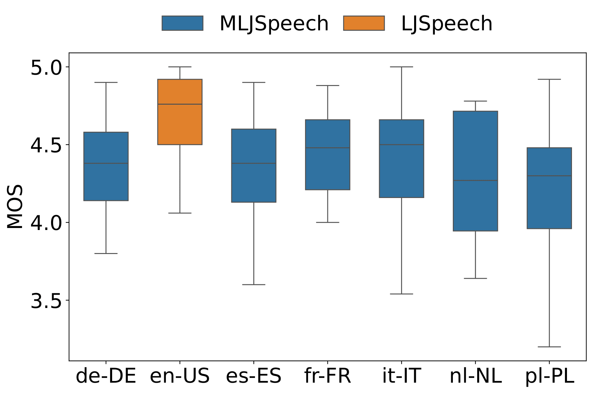
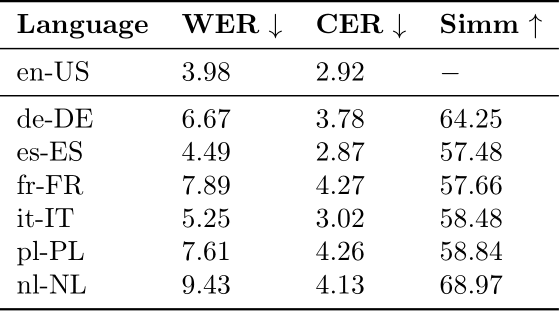
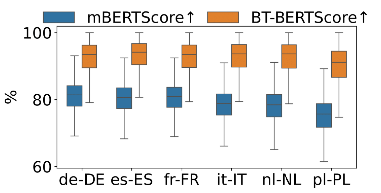

# Building a Multilingual Single-Speaker Dataset via Cross-Lingual Voice Cloning from LJSpeech

## Abstract
Speech synthesis models transform written text into lifelike, natural-sounding speech. However, even in multilingual systems, they often produce different voices for each language due to the lack of robust cross-lingual datasets and benchmarks.

In this work, we introduce the **MLJSpeech** corpus, a multilingual dataset created by translating and voice-cloning the widely used LJSpeech dataset into multiple languages. To evaluate the quality of MLJSpeech, we conducted a Mean Opinion Score (MOS) assessment, achieving high perceptual quality across all target languages.

- The original LJSpeech received a MOS of **4.71 ± 0.51**.
- Our synthesized dataset maintained comparable performance across languages, such as French (**4.41 ± 0.71**).

MLJSpeech represents a significant step toward advancing cross-lingual TTS systems and fostering inclusivity in multilingual speech synthesis research.

## Results

### Human Mean Opinion Scores on LJSpeech and MLJSpeech

### Evaluation of Correctness and Coherence

### Multilingual and Back Translation BERT Scores

## Audio Samples
| Original ID  | Text  | en-US | de-DE | es-ES | fr-FR | it-IT | nl-NL | pl-PL |
|-------------|------|------|------|------|------|------|------|------|
| **LJ016-0341** | *The sufferer was stolid and reticent to the last.* | [🔊](./audios/mlj/en-US/audio/LJ016-0341.wav) | [🔊](./audios/mlj/de-DE/audio/LJ016-0341.wav) | [🔊](./audios/mlj/es-ES/audio/LJ016-0341.wav) | [🔊](./audios/mlj/fr-FR/audio/LJ016-0341.wav) | [🔊](./audios/mlj/it-IT/audio/LJ016-0341.wav) | [🔊](./audios/mlj/nl-NL/audio/LJ016-0341.wav) | [🔊](./audios/mlj/pl-PL/audio/LJ016-0341.wav) |
| **LJ016-0398** | *As a special favor.* | [🔊](./audios/mlj/en-US/audio/LJ016-0398.wav) | [🔊](./audios/mlj/de-DE/audio/LJ016-0398.wav) | [🔊](./audios/mlj/es-ES/audio/LJ016-0398.wav) | [🔊](./audios/mlj/fr-FR/audio/LJ016-0398.wav) | [🔊](./audios/mlj/it-IT/audio/LJ016-0398.wav) | [🔊](./audios/mlj/nl-NL/audio/LJ016-0398.wav) | [🔊](./audios/mlj/pl-PL/audio/LJ016-0398.wav) |
| **LJ017-0210** | *The first case was that of the 'Flowery Land'.* | [🔊](./audios/mlj/en-US/audio/LJ017-0210.wav) | [🔊](./audios/mlj/de-DE/audio/LJ017-0210.wav) | [🔊](./audios/mlj/es-ES/audio/LJ017-0210.wav) | [🔊](./audios/mlj/fr-FR/audio/LJ017-0210.wav) | [🔊](./audios/mlj/it-IT/audio/LJ017-0210.wav) | [🔊](./audios/mlj/nl-NL/audio/LJ017-0210.wav) | [🔊](./audios/mlj/pl-PL/audio/LJ017-0210.wav) |

(For a full list of samples, visit the [project webpage](https://samsung.github.io/MLJSpeech/).)

## About LJSpeech
[LJSpeech](https://keithito.com/LJ-Speech-Dataset/) is a widely used dataset in the Text-to-Speech (TTS) domain. It comprises approximately **24** hours of recordings from a single speaker reading passages from English nonfiction books. The audio was originally recorded by Linda Johnson as part of the LibriVox project. Corresponding texts were published between **1884** and **1964** and aligned by Keith Ito. Both have been released into the public domain. Since its release, LJSpeech has been extensively utilized to demonstrate various advancements in TTS systems.
